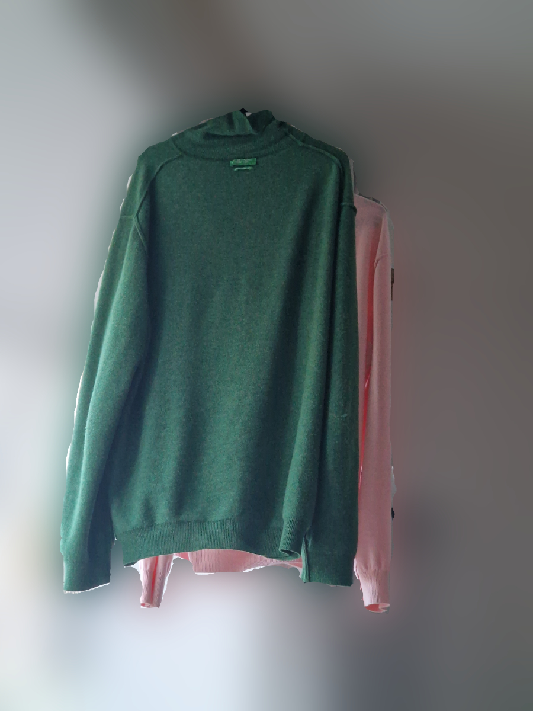
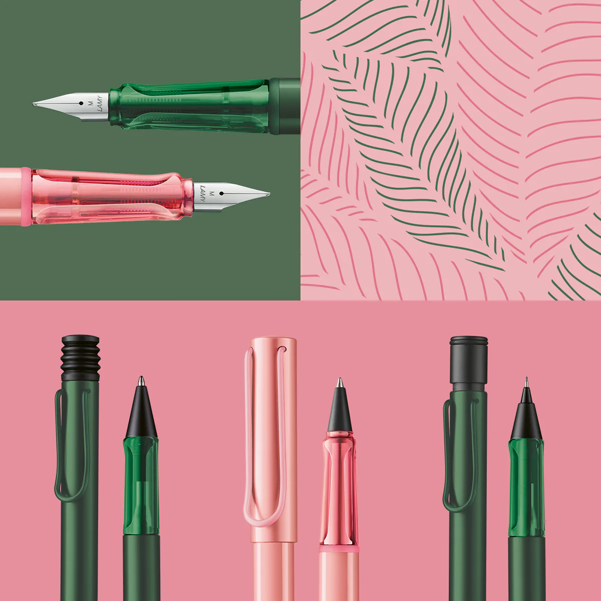
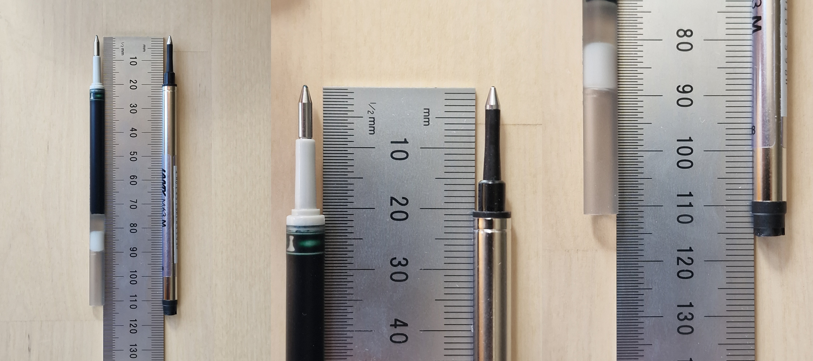
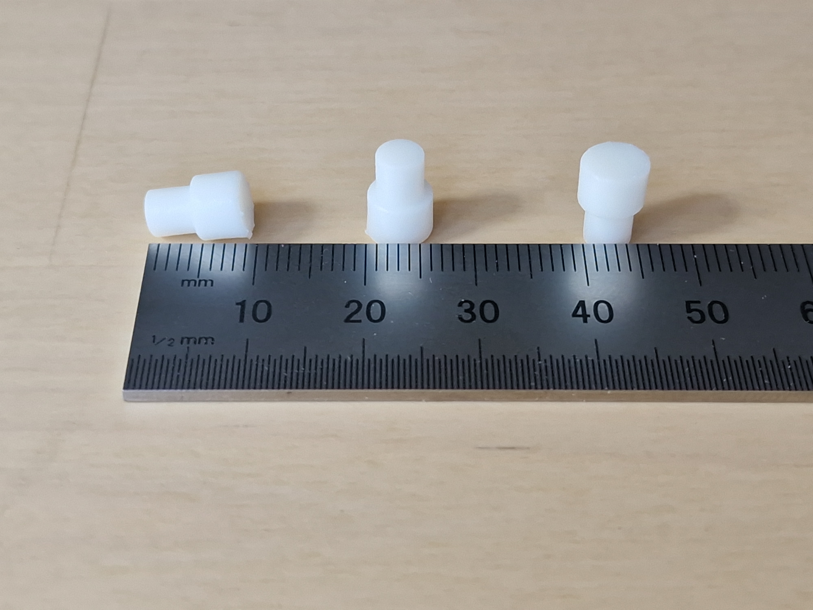
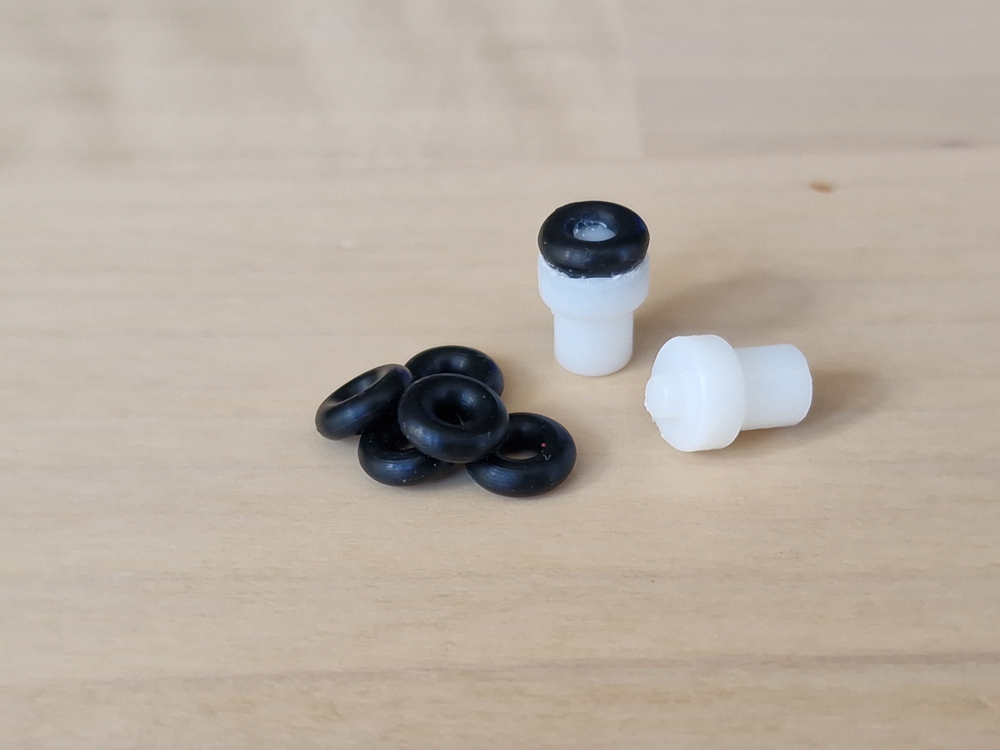
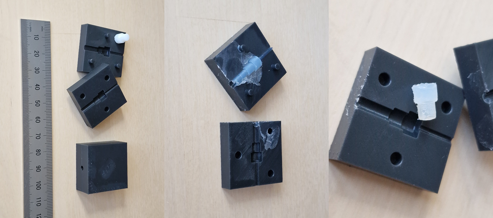
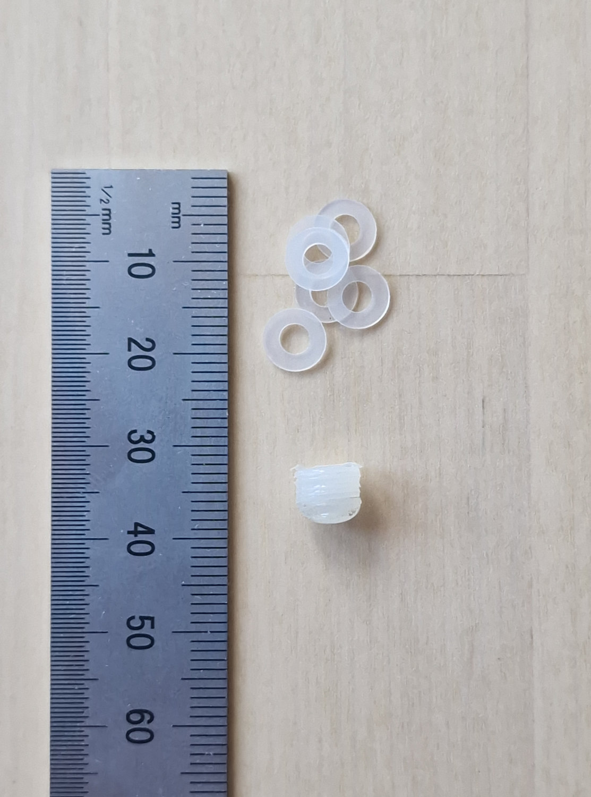
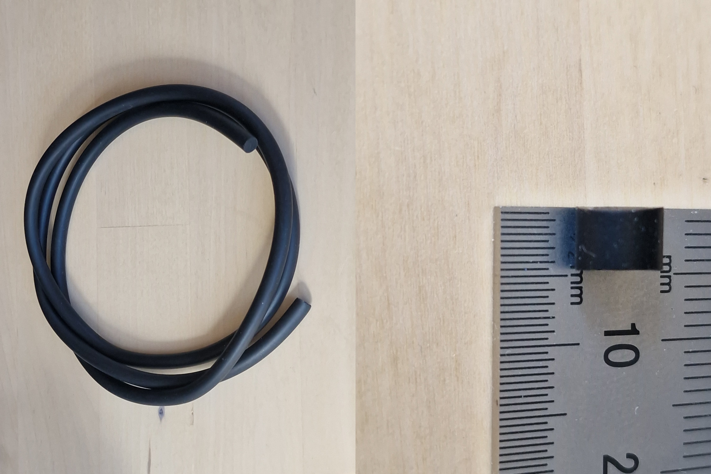

# Pentel Energel to Lamy M63 refill adapters

Update: I realised that the Energel refill is basically a Euro format / Euro-style refill. Approach 5 will also work with other Euro-style refills.

## 1 - Introduction
I had hung up some of my sweaters to air them out, and I looked at them and realised... 

It had to be done.

Source: https://lamy.gr/products/lamy-al-star-3b9-pine-special-edition-2026-rollerball

I didn't want the fountain pen, and I don't really like the design of the ballpoint. The bellows look a bit funny, and perhaps more importantly, adapting the M16 ballpoint refill is not super easy. Monteverde does make M16 compatible refills in many colours, but they are still ballpoint ink - you can't get rollerball or gel ink (e.g. their P42 which I use in a Rotring 600). 
TOFTY has a D1 to M16 adapter, but the D1 refills are quite annoying (small volume), and poor value for money.
https://cults3d.com/en/3d-model/tool/pen-refill-adapter-lamy-m16-to-d1-mini

However, the M63 refill that comes in the rollerball is quite close to the Pentel Energel refill, and can be adapted pretty easily. The Energel refill is quite good. I prefer the Uniball Signo DX, Uniball One, Uniball Zento, and maybe the Pilot Juice Up, but the Energel refill is much better than the OEM refills (and available in pink and dark green) so I'll take it.

### 1.1 - Differences between the refills
The tip dimensions and shape are quite similar, which is what makes this possible.
The ODs of both could be considered identical, 6.17 mm for the M63, and 6.15 mm for the Energel. 
The main thing to worry about is the overall length, about 4.5 mm needs to be added to the Energel refill.

My suspicion is that the rubber moulding on the end of M63 is to provide some cushioning when you apply a lot of pressure, and to provide some margin/allowance for small variation in refill length manufacturing - since the end of the refill does contact the rear of the pen.

## 2 - Approach 1: 3D printed adapter

The STL file is provided for this in the STLfiles folder, "RefillAdapter.stl".
Quite straight forward, don't really recommend it, since it doesn't provide the cushioning/margin.

## 3 - Approach 2: 3D printed adapter with o-ring

I had these NBR o-rings from a previous thing, 2 mm ID and 2 mm CS (so 6 mm OD), and I realised they could work in this situation.
So I modified the above design to include a pin to fit the o-ring on. The o-ring is held in place by super/CA glue because the pin is not long enough.
The STL file is provided in the STLfiles folder, "RefillAdapterOring.stl".
This works quite well.

## 4 - Approach 3: Moulded adapter
I realised that I could make a mould from the design in Approach 1, and then do some home injection moulding with various off the shelf compounds.

In the end I didn't want to buy moulding supplies that I would just use for these small items. However, I did run a test with hot glue. I sprayed the moulds with silicone lubricant spray in the place of mould release.
It worked fairly well and produced the desired end product with some cleaning up of the flash.

The hot glue is a bit too soft, and still remains a bit sticky after cooling - so I don't recommend this.
If you can find RTV Silicone (55-70 shore A) in the 2-part syringes, that might be the best option, but I haven't tried it. Don't use silicone-based mould release if you use a silicone material for the part.

The mould halves are in the STLfiles folder, "Mould_holes.stl" and "Mould_pins.stl".

## 5 - Approach 4: Nylon washers
I found some M3 nylon washers with 7 mm OD, and claimed thickness of 0.5 mm.
The ones that were delivered ended up being closer to 0.7 mm, but my idea was to stack them and then glue them together. The hot glue would also provide the cushioning effect.

Don't do this, it was very bad.
The stickiness of the hot glue was a problem, and 7 mm OD is also slightly too big and it gets stuck inside the pen.

## 6 - Approach 5: Rubber cord
I realised that since we essentially want a ~6 mm rubber stopper, this could be achieved with o-ring cord.
You can also cut it to whatever length you need to account for variations in refill tolerance etc.
I used a 70 shore A hardness NBR cord, 6 mm diameter. If you can find 1/4" that will also work. Don't get 7 mm (or smaller than 6 mm).

This is quite cost effective, 1 m was ~$4, and it works quite well.
You can sit it on the end of the refill while you screw on the pen body from above, or you could also tape it to the top of the refill. Don't fully seal the end of the refill, because air needs to get in. If you want to get creative, you could probably whittle a piece into a shape that fits into the end of the Energel refill and holds itself in place.

## 7 - Conclusions
Overall, I would recommend approach 5 for the simplest, quickest, and most cost effective way that works. I am currently using approach 2 because I have them.
The main thing is, there should only be a small amount of resistance when you screw down the barrel. You can feel what it is like with the OEM M63 refill. If it is any more than that, then your adapter is too long - trim either the adapter or the Energel refill.
